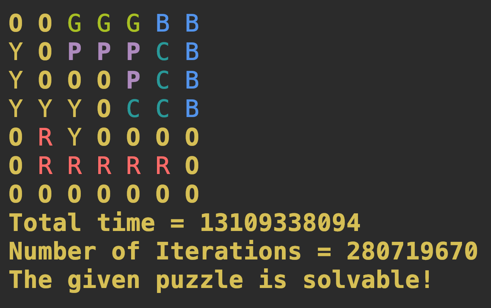

# FreeFlowAlgo4
## Project 4 for Algorithms 6261

### Free Flow Solver using DFS (Depth First Search)

The project is aimed to create an automated solver for the Free Flow Game.
The constants (filename, Gridsixe, Animation switch, Multiple Outputs) are defined in the Constants,java

The algorithm prints the final solution with colored paths for each input color.

Inputs are provided in input1.txt

Color Codes (supported) :

#### W - EMPTY SPACE
#### R - RED
#### Y - YELLOW
#### G - GREEN
#### B - BLUE
#### P - PINK
#### M - MAGENTA
#### O - ORANGE
#### C - CYAN
#### w - WHITE //Note: Use lowercase char


### Sample Input:

```
OWGWGBW 
YWPWWCW 
WWWWPWW 
WWWWCWB 
ORYWWWW 
WWWWWRW 
WWWWWWW
```

Sample output:



